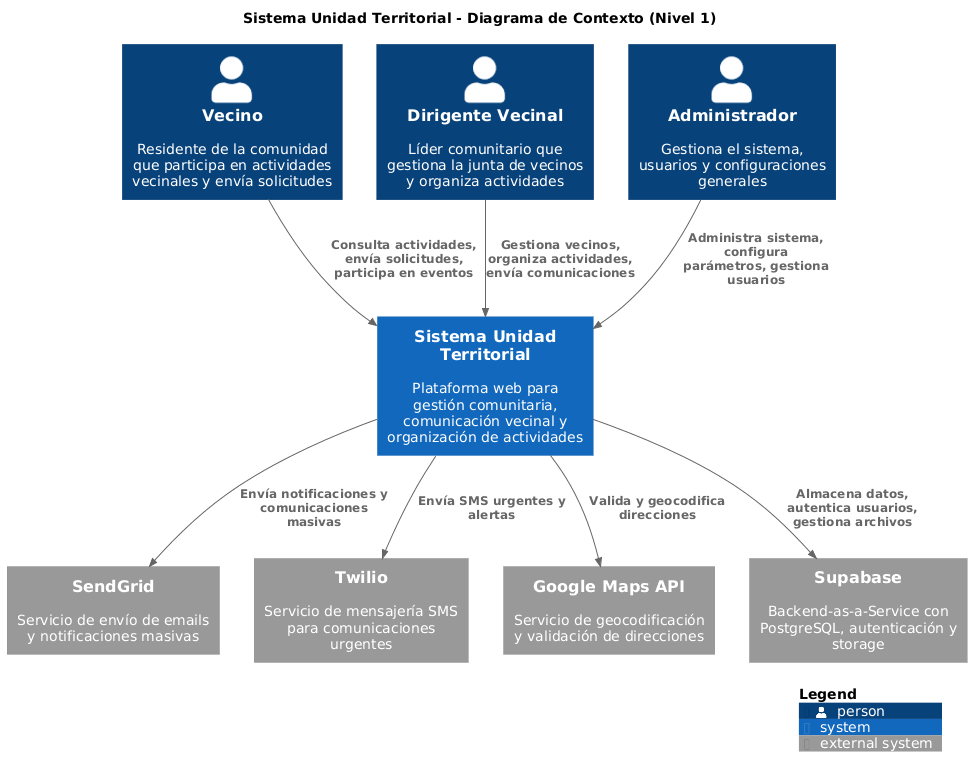
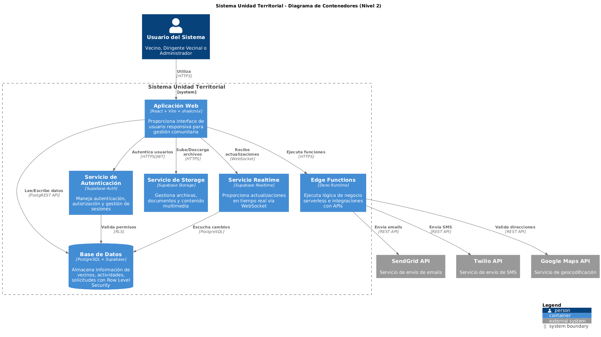
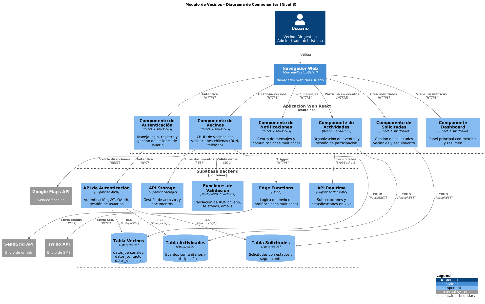
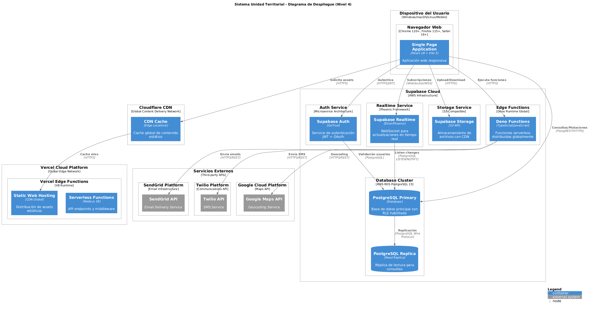

[volver](../README.md)

# Sistema Unidad Territorial - Arquitectura C4

## Nivel 1 - Diagrama de Contexto

Usuarios: Vecinos, Dirigentes y Administradores     
Sistema principal de gestión vecinal    
Sistemas externos: SendGrid, Twilio, Google Maps, Supabase

[volver](../README.md)

---

## Nivel 2 - Diagrama de Contenedores

Frontend: React + Vite con shadcn/ui    
API Gateway: Express.js + Node.js   
Servicios: Autenticación y Notificaciones   
Base de datos: PostgreSQL + Supabase

[volver](../README.md)

---

## Nivel 3 - Diagrama de Componentes

Controllers: Auth, Vecinos, Solicitudes, Actividades, Notificaciones    
Services: Lógica de negocio, validaciones, direcciones  
Integraciones con APIs externas

[volver](../README.md)

---

## Nivel 4 - Diagrama de Despliegue

Frontend: Vercel + Cloudflare CDN   
Backend: Railway con Docker 
Base de datos: Supabase Cloud   
APIs externas: SendGrid, Twilio, Google Maps

[volver](../README.md)

___