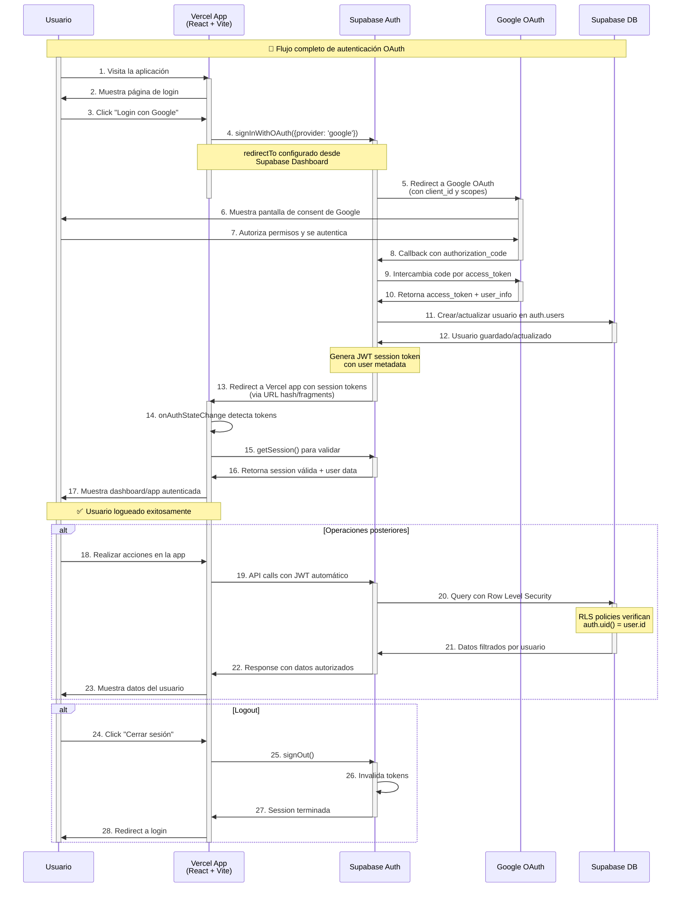

[volver](Especificaciones_Técnicas-Módulo_Autenticación_OAuth.md)

# Diagrama de Secuencia OAuth

## Flujo de autenticación: React + Vite + Supabase + Google OAuth + Vercel



## Componentes de la Arquitectura

### 🌐 **Frontend (Vercel)**
- **React + Vite**: Aplicación SPA con bundler moderno
- **Variables de entorno**: `VITE_SUPABASE_URL`, `VITE_SUPABASE_ANON_KEY`
- **Despliegue**: Vercel con CI/CD automático desde Git

### 🔐 **Supabase Auth**
- **OAuth Provider**: Intermediario entre Google y nuestra app
- **JWT Generation**: Crea tokens seguros con metadata del usuario
- **Session Management**: Maneja refresh tokens automáticamente

### 🔍 **Google OAuth 2.0**
- **Identity Provider**: Valida credenciales del usuario
- **Scope**: `openid profile email` para obtener info básica
- **Security**: PKCE flow para aplicaciones SPA

### 💾 **Supabase Database**
- **PostgreSQL**: Base de datos con extensiones de auth
- **Row Level Security**: Políticas a nivel de fila
- **Real-time**: Subscripciones en tiempo real (opcional)

## Configuración Requerida

### En Supabase Dashboard
```
Authentication → Settings:
├── Site URL: https://my-app-vite-01.vercel.app
├── Redirect URLs:
│   └── https://my-app-vite-01.vercel.app
└── Google OAuth:
    ├── Client ID: [desde Google Cloud Console]
    └── Client Secret: [desde Google Cloud Console]
```

### En Google Cloud Console
```
APIs & Services → Credentials → OAuth 2.0 Client:
└── Authorized redirect URIs:
    └── https://[proyecto].supabase.co/auth/v1/callback
```

### En Vercel
```
Environment Variables:
├── VITE_SUPABASE_URL=https://[proyecto].supabase.co
└── VITE_SUPABASE_ANON_KEY=eyJ[token]...
```

## Notas Importantes

- 🔑 **Seguridad**: Las variables `VITE_*` son públicas por diseño
- 🛡️ **Protección**: La seguridad real está en RLS policies
- 🔄 **Redirects**: Supabase Dashboard controla las redirecciones
- ⚡ **Performance**: JWT tokens se manejan automáticamente
- 🌍 **Ambientes**: Misma configuración para dev y prod