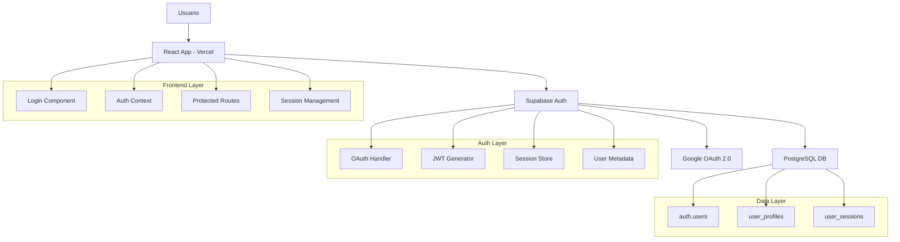

[volver](README.md)

# Sistema Unidad Territorial - Especificaciones Técnicas - Módulo Autenticación OAuth

**Versión**: 1.0  
**Módulo**: Autenticación OAuth  
**Fecha**: Septiembre 2025  
**Proyecto**: Sistema Unidad Territorial  
**Autor**: @marcobarrerati

---

## 1. Descripción General

### 1.1 Propósito
Implementar un sistema de autenticación robusto y seguro utilizando OAuth 2.0 con Google como proveedor de identidad, integrado con Supabase como backend de autenticación y desplegado en Vercel.

### 1.2 Alcance
- Autenticación OAuth con Google
- Gestión de sesiones segura
- Integración con base de datos de usuarios
- Despliegue multi-ambiente (desarrollo/producción)

### 1.3 Tecnologías Principales
- **Frontend**: [React](https://react.dev/) + [Vite](https://vite.dev/) + [TypeScript](https://www.typescriptlang.org/)
- **Autenticación**: [Supabase Auth + Google OAuth 2.0](https://supabase.com/docs/guides/auth/social-login/auth-google)
- **Base de Datos**: [PostgreSQL (Supabase)](https://supabase.com/)
- **Despliegue**: [Vercel](https://vercel.com/)
- **Styling**: [Shadcn](https://ui.shadcn.com/)

---

## 2. Arquitectura del Sistema

### 2.1 Componentes Principales



### 2.2 Flujo de Datos
1. **Iniciación**: Usuario accede a la aplicación
2. **Autenticación**: [OAuth flow](OAuthFlow.md)
3. **Verificación**: Supabase valida credenciales
4. **Sesión**: Generación de JWT tokens
5. **Persistencia**: Almacenamiento seguro de sesión
6. **Autorización**: Validación de permisos por request

---

## 3. Modelo de Base de Datos

### 3.1 Esquema Principal

```sql
-- Tabla principal de usuarios (Supabase Auth)
-- Esta tabla es gestionada automáticamente por Supabase
auth.users (
  id UUID PRIMARY KEY DEFAULT gen_random_uuid(),
  email VARCHAR(255) UNIQUE NOT NULL,
  encrypted_password VARCHAR(255),
  email_confirmed_at TIMESTAMP,
  invited_at TIMESTAMP,
  confirmation_token VARCHAR(255),
  confirmation_sent_at TIMESTAMP,
  recovery_token VARCHAR(255),
  recovery_sent_at TIMESTAMP,
  email_change_token_new VARCHAR(255),
  email_change VARCHAR(255),
  email_change_sent_at TIMESTAMP,
  last_sign_in_at TIMESTAMP,
  raw_app_meta_data JSONB,
  raw_user_meta_data JSONB,
  is_super_admin BOOLEAN,
  created_at TIMESTAMP DEFAULT NOW(),
  updated_at TIMESTAMP DEFAULT NOW()
);

-- Extensión de perfil de usuario
CREATE TABLE public.user_profiles (
  id UUID PRIMARY KEY REFERENCES auth.users(id) ON DELETE CASCADE,
  email VARCHAR(255) NOT NULL,
  full_name VARCHAR(255),
  avatar_url TEXT,
  provider VARCHAR(50), -- 'google', 'email'
  phone VARCHAR(20),
  is_verified BOOLEAN DEFAULT FALSE,
  preferences JSONB DEFAULT '{}',
  last_login TIMESTAMP,
  created_at TIMESTAMP DEFAULT NOW(),
  updated_at TIMESTAMP DEFAULT NOW()
);

-- Sesiones activas (para tracking)
CREATE TABLE public.user_sessions (
  id UUID PRIMARY KEY DEFAULT gen_random_uuid(),
  user_id UUID REFERENCES auth.users(id) ON DELETE CASCADE,
  refresh_token_hash VARCHAR(255),
  user_agent TEXT,
  ip_address INET,
  expires_at TIMESTAMP,
  created_at TIMESTAMP DEFAULT NOW()
);
```

### 3.2 Índices y Optimizaciones

```sql
-- Índices para optimizar consultas
CREATE INDEX idx_user_profiles_email ON public.user_profiles(email);
CREATE INDEX idx_user_profiles_provider ON public.user_profiles(provider);
CREATE INDEX idx_user_sessions_user_id ON public.user_sessions(user_id);
CREATE INDEX idx_user_sessions_expires_at ON public.user_sessions(expires_at);

-- Índices para búsquedas frecuentes
CREATE INDEX idx_users_last_sign_in ON auth.users(last_sign_in_at);
CREATE INDEX idx_users_email_confirmed ON auth.users(email_confirmed_at) WHERE email_confirmed_at IS NOT NULL;
```

### 3.3 Triggers y Funciones

```sql
-- Función para crear perfil automáticamente
CREATE OR REPLACE FUNCTION public.handle_new_user()
RETURNS TRIGGER AS $$
BEGIN
  INSERT INTO public.user_profiles (
    id, 
    email, 
    full_name, 
    avatar_url, 
    provider
  )
  VALUES (
    NEW.id,
    NEW.email,
    COALESCE(NEW.raw_user_meta_data->>'full_name', ''),
    COALESCE(NEW.raw_user_meta_data->>'avatar_url', ''),
    COALESCE(NEW.raw_app_meta_data->>'provider', 'email')
  );
  RETURN NEW;
END;
$$ LANGUAGE plpgsql SECURITY DEFINER;

-- Trigger para ejecutar la función
CREATE TRIGGER on_auth_user_created
  AFTER INSERT ON auth.users
  FOR EACH ROW EXECUTE PROCEDURE public.handle_new_user();

-- Función para actualizar timestamp
CREATE OR REPLACE FUNCTION public.update_updated_at_column()
RETURNS TRIGGER AS $$
BEGIN
  NEW.updated_at = NOW();
  RETURN NEW;
END;
$$ LANGUAGE plpgsql;

-- Triggers para timestamps automáticos
CREATE TRIGGER update_user_profiles_updated_at
  BEFORE UPDATE ON public.user_profiles
  FOR EACH ROW EXECUTE PROCEDURE public.update_updated_at_column();
```

---

## 4. Seguridad y Políticas RLS

### 4.1 Row Level Security (RLS)

```sql
-- Habilitar RLS en todas las tablas públicas
ALTER TABLE public.user_profiles ENABLE ROW LEVEL SECURITY;
ALTER TABLE public.user_sessions ENABLE ROW LEVEL SECURITY;

-- Políticas para user_profiles
CREATE POLICY "Users can view own profile" ON public.user_profiles
  FOR SELECT USING (auth.uid() = id);

CREATE POLICY "Users can update own profile" ON public.user_profiles
  FOR UPDATE USING (auth.uid() = id);

CREATE POLICY "Users can insert own profile" ON public.user_profiles
  FOR INSERT WITH CHECK (auth.uid() = id);

-- Políticas para user_sessions
CREATE POLICY "Users can view own sessions" ON public.user_sessions
  FOR SELECT USING (auth.uid() = user_id);

CREATE POLICY "Users can delete own sessions" ON public.user_sessions
  FOR DELETE USING (auth.uid() = user_id);
```

### 4.2 Configuración de Seguridad

```typescript
// Configuración de Supabase con opciones de seguridad
const supabaseOptions = {
    auth: {
        autoRefreshToken: true,
        persistSession: true,
        detectSessionInUrl: true,
        flowType: 'pkce' as const // Proof Key for Code Exchange
    },
    global: {
        headers: {
            'x-application': 'vecinal-management-system'
        }
    }
};
```

---

## 5. Implementación Frontend

### 5.1 Estructura de Archivos

```
src/
├── supabaseConfig.ts            # Cliente Supabase
├── hooks/
│   ├── useAuth.ts               # Hook de autenticación
│   └── useRequireAuth.ts        # Hook de sesión
├── components/
│   ├── ui/                      # Componentes shadcn/ui
│   ├── AppSidebar.tsx           # Menú de navegación
│   └── LoginForm.tsx            # Formulario de login
├── layout/
│   └── MainLayout.tsx           # Layout principal y protegido
├── pages/                       # Páginas de la aplicación
│   └── unidad-vecinal           # Páginas específicas del sistema unidad vecinal
└── contexts/
    └── AuthContext.tsx          # Contexto de autenticación
```

### 5.2 Configuración Principal

```typescript
// supabaseConfig.ts
import { createClient } from '@supabase/supabase-js';

const supabaseUrl = import.meta.env.VITE_SUPABASE_URL || '';
const supabaseAnonKey = import.meta.env.VITE_SUPABASE_ANON_KEY || '';

const supabaseOptions = {
    auth: {
        autoRefreshToken: true,
        persistSession: true,
        detectSessionInUrl: true,
        flowType: 'pkce' as const // Proof Key for Code Exchange
    },
    global: {
        headers: {
            'x-application': 'vecinal-management-system'
        }
    }
};
export const supabase = createClient(supabaseUrl, supabaseAnonKey, supabaseOptions);

// context/AuthContext.ts
    
// ...
const loginWithGoogle = useCallback(async () => {

    setLoading(true);
    setError(null);

    try {

        const { error } = await supabase.auth.signInWithOAuth({
            provider: 'google' as Provider,
            options: {
                redirectTo: window.location.origin + '/' // Redirige a la raíz "/"
            }
        });

        console.log('Google sign-in initiated');

        if (error) {
            throw error;
        }

        // Aquí se podría añadir seguimiento analítico si fuera necesario

    } catch (err) {
        setError((err as Error).message);
    } finally {
        setLoading(false);
    }
}, []);

const logout = useCallback(async () => {
    setLoading(true);
    setError(null);

    try {

        // Realiza el cierre de sesión
        const { error } = await supabase.auth.signOut();

        if (error) {
            throw error;
        }

        // Aquí se podría añadir seguimiento analítico si fuera necesario

    } catch (err) {
        setError((err as Error).message);
    } finally {
        setLoading(false);
    }
}, []);
    
// ...

```

### 5.3 Hook de Autenticación

```typescript
// hooks/useAuth.ts

import { useContext } from "react";
import AuthContext, { AuthContextType } from "@/context/AuthContext";

const useAuth = (): AuthContextType => {
    const context = useContext(AuthContext);
    if (!context) {
        throw new Error("useAuth must be used within an AuthProvider");
    }
    return context;
};
export default useAuth;

```

---

## 6. Configuración de Ambientes

### 6.1 Variables de Entorno

```bash
# .env.local (Desarrollo)
VITE_SUPABASE_URL=https://[proyecto-dev].supabase.co
VITE_SUPABASE_ANON_KEY=eyJ[token-dev]...

# Vercel (Producción)
VITE_SUPABASE_URL=https://[proyecto-prod].supabase.co
VITE_SUPABASE_ANON_KEY=eyJ[token-prod]...
```

### 6.2 Configuración de URLs

**Supabase Dashboard:**
```
Authentication → Settings:
├── Site URL: https://mi-app-vecinal.vercel.app
├── Redirect URLs:
│   ├── http://localhost:5173
│   └── https://mi-app-vecinal.vercel.app
└── Additional Redirect URLs:
    └── https://mi-app-vecinal-dev.vercel.app
```

**Google Cloud Console:**
```
OAuth 2.0 Client → Authorized Redirect URIs:
└── https://[proyecto].supabase.co/auth/v1/callback
```

---


## 7. Testing y Validación

### 7.1 Casos de Prueba Críticos

```typescript
// auth.test.ts
describe('Módulo de Autenticación', () => {
  test('Login con Google OAuth exitoso', async () => {
    // Simular flujo OAuth completo
    const result = await supabase.auth.signInWithGoogle();
    expect(result.error).toBeNull();
    expect(result.data).toBeDefined();
  });

  test('Logout exitoso', async () => {
    const result = await supabase.auth.signOut();
    expect(result.error).toBeNull();
  });

  test('Persistencia de sesión', async () => {
    // Verificar que la sesión persiste después de refresh
    const { data } = await supabase.auth.getSession();
    expect(data.session).toBeDefined();
  });

  test('RLS policies funcionando', async () => {
    // Verificar que usuarios solo ven sus propios datos
    const { data, error } = await supabase
      .from('user_profiles')
      .select('*');
    
    expect(error).toBeNull();
    expect(data).toHaveLength(1); // Solo su propio perfil
  });
});
```

### 7.2 Datos de Prueba

```sql
-- Datos de prueba para desarrollo
INSERT INTO auth.users (
  id, 
  email, 
  encrypted_password,
  email_confirmed_at,
  raw_user_meta_data
) VALUES (
  'test-user-uuid',
  'test@ejemplo.com',
  crypt('password123', gen_salt('bf')),
  NOW(),
  '{"full_name": "Usuario de Prueba", "avatar_url": ""}'::jsonb
);
```

---

## 8. Métricas y Monitoreo

### 8.1 KPIs de Autenticación

```sql
-- Query para métricas de autenticación
-- Usuarios activos por día
SELECT 
  DATE(last_sign_in_at) as fecha,
  COUNT(*) as usuarios_activos
FROM auth.users 
WHERE last_sign_in_at >= NOW() - INTERVAL '30 days'
GROUP BY DATE(last_sign_in_at)
ORDER BY fecha DESC;

-- Distribución por proveedor
SELECT 
  raw_app_meta_data->>'provider' as proveedor,
  COUNT(*) as total_usuarios,
  ROUND(COUNT(*) * 100.0 / SUM(COUNT(*)) OVER(), 2) as porcentaje
FROM auth.users
GROUP BY raw_app_meta_data->>'provider';

-- Tasa de verificación de email
SELECT 
  COUNT(CASE WHEN email_confirmed_at IS NOT NULL THEN 1 END) as verificados,
  COUNT(*) as total,
  ROUND(
    COUNT(CASE WHEN email_confirmed_at IS NOT NULL THEN 1 END) * 100.0 / COUNT(*), 2
  ) as tasa_verificacion
FROM auth.users;
```

### 8.2 Alertas y Logs

```typescript
// Configuración de logging
const logAuthEvent = (event: string, user?: User, error?: Error) => {
  console.log({
    timestamp: new Date().toISOString(),
    event,
    user_id: user?.id,
    email: user?.email,
    error: error?.message,
    user_agent: navigator.userAgent
  });
};

// Eventos a trackear
// - Intentos de login exitosos/fallidos
// - Registros nuevos
// - Logouts
// - Errores de autenticación
// - Intentos de acceso no autorizado
```

---

## 9. Despliegue y DevOps

### 9.1 Pipeline de CI/CD

* GitHub -> Vercel

### 9.2 Configuración de Producción

* GitHub -> Vercel

---

## 10. Troubleshooting

### 10.1 Problemas Comunes

| Problema                | Causa                              | Solución                         |
| ----------------------- | ---------------------------------- | -------------------------------- |
| Redirect no funciona    | URL no está en Supabase settings   | Agregar URL a Redirect URLs      |
| `process.env` undefined | Usando Node.js vars en Vite        | Usar `import.meta.env`           |
| Session no persiste     | localStorage bloqueado             | Verificar permisos del navegador |
| OAuth callback error    | Configuración incorrecta en Google | Verificar Client ID y Secret     |
| RLS bloquea queries     | Políticas mal configuradas         | Revisar políticas RLS            |

### 10.2 Debug Utils

```typescript
// Utilidades para debugging
export const debugAuth = {
  logSession: () => {
    supabase.auth.getSession().then(({ data }) => {
      console.log('Current session:', data.session);
    });
  },
  
  logUser: () => {
    supabase.auth.getUser().then(({ data }) => {
      console.log('Current user:', data.user);
    });
  },
  
  testRLS: async () => {
    const { data, error } = await supabase
      .from('user_profiles')
      .select('*');
    console.log('RLS test:', { data, error });
  }
};

// Usar en consola del navegador para debugging
// debugAuth.logSession();
```

---


## 11. Documentación de Referencia

### 11.1 Enlaces Útiles

- [Supabase Auth Documentation](https://supabase.com/docs/guides/auth)
- [Google OAuth 2.0 Guide](https://developers.google.com/identity/protocols/oauth2)
- [Vercel Deployment Guide](https://vercel.com/docs/deployments)
- [React Authentication Best Practices](https://react.dev/learn/escape-hatches)

### 11.2 Comandos Útiles

```bash
# Desarrollo
npm run dev                    # Iniciar servidor de desarrollo
npm run build                  # Build para producción
npm run test                   # Ejecutar tests
npm run type-check            # Verificar tipos TypeScript

# Supabase
npx supabase start            # Iniciar Supabase local
npx supabase db reset         # Reset base de datos local
npx supabase gen types        # Generar tipos TypeScript

# Vercel
vercel dev                    # Desarrollo local con Vercel
vercel --prod                 # Deploy a producción
vercel logs                   # Ver logs de producción
```

---

**Estado**: ✅ Especificación Completa  
**Última Actualización**: Septiembre 2025  
**Próxima Revisión**: Octubre 2025