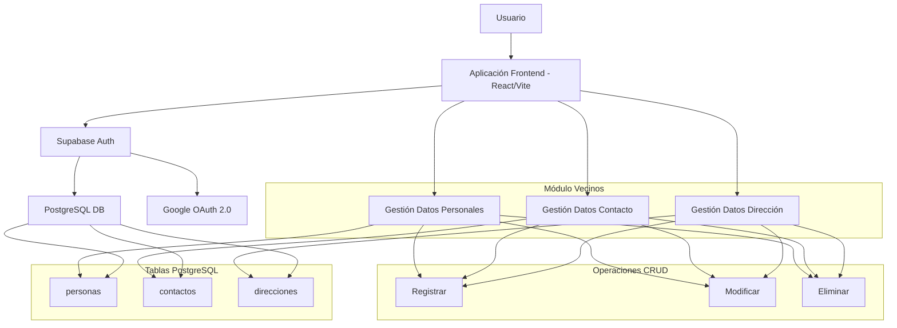

[volver](README.md)

# Sistema Unidad Territorial - Especificaciones Técnicas - Módulo Vecinos

**Versión**: 1.0  
**Módulo**: Vecinos  
**Fecha**: Septiembre 2025  
**Proyecto**: Sistema Unidad Territorial
**Autor**: @marcobarrerati

## 1. Descripción General

### 1.1 Propósito
El Módulo Vecinos tiene como objetivo gestionar de manera integral los datos de las personas pertenecientes a la unidad vecinal, organizando la información en tres secciones principales: datos personales, datos de contacto y datos de dirección.

### 1.2 Alcance
- Registro y gestión de datos de vecinos
- Validación de información según estándares chilenos
- Integración con APIs de geolocalización
- Cumplimiento de normativas de protección de datos

### 1.3 Arquitectura Base
- **Frontend**: [React](https://react.dev/) + [Vite](https://vite.dev/) + [TypeScript](https://www.typescriptlang.org/)
- **Autenticación**: [Supabase Auth + Google OAuth 2.0](https://supabase.com/docs/guides/auth/social-login/auth-google)
- **Base de Datos**: [PostgreSQL (Supabase)](https://supabase.com/)
- **Despliegue**: [Vercel](https://vercel.com/)
- **Styling**: [Shadcn](https://ui.shadcn.com/)


- **Base de Datos**: [PostgreSQL (Supabase)](https://supabase.com/)
- **Clave foránea principal**: `user_id` [UUID](https://developer.mozilla.org/en-US/docs/Glossary/UUID)
- **API de geolocalización**: [Google Maps API](https://developers.google.com/maps/apis-by-platform?hl=es-419)
- **Normativa de referencia**: [Registro Civil de Chile, Ley 19.628](https://www.dipres.gob.cl/598/articles-51683_Otrasleyes_ley19628.pdf)

## 2. Arquitectura del Sistema
### 2.1 Componentes Principales
### 2.1 Componentes Principales


## 2.2 Flujo de Datos
## 2.2 Flujo de Datos

### Datos Personales
1. **Iniciación**: Usuario completa formulario de datos personales
2. **Validación**: Sistema valida formato RUN y campos obligatorios
3. **Procesamiento**: Aplicación formatea datos (mayúsculas, eliminación de espacios)
4. **Almacenamiento**: Datos son enviados a tabla `personas` en PostgreSQL
5. **Confirmación**: Usuario recibe confirmación de registro exitoso
6. **Actualización**: Modificaciones posteriores generan registros de auditoría

### Datos de Contacto
1. **Iniciación**: Usuario ingresa información de contacto
2. **Validación**: Sistema valida formato de email y teléfono
3. **Verificación**: Envío de código de verificación a email/teléfono
4. **Confirmación**: Usuario verifica su información de contacto
5. **Almacenamiento**: Datos son guardados en tabla `contactos`
6. **Consentimiento**: Registro de preferencias de comunicación según Ley 19.628

### Datos de Dirección
1. **Iniciación**: Usuario ingresa dirección en formulario
2. **Autocompletado**: Google Places API sugiere direcciones válidas
3. **Validación**: Address Validation API verifica existencia de la dirección
4. **Geolocalización**: Geocoding API obtiene coordenadas y Place ID
5. **Almacenamiento**: Información completa guardada en tabla `direcciones`
6. **Visualización**: Opción de ver dirección en mapa para confirmar ubicación

## 3. Modelo de Base de Datos

### 3.1 Esquem Principal

```sql
-- Tabla Personas
-- Esta tabla almacena los datos de identificación de la persona
CREATE TABLE personas (
    id UUID PRIMARY KEY DEFAULT gen_random_uuid(),
    id_usuario UUID NOT NULL REFERENCES auth.users(id) ON DELETE CASCADE,
    
    -- Datos personales según Registro Civil Chile
    run VARCHAR(12) UNIQUE NOT NULL, -- Formato: XX.XXX.XXX-X
    nombres VARCHAR(100) NOT NULL,
    apellido_paterno VARCHAR(50) NOT NULL,
    apellido_materno VARCHAR(50), -- Opcional según normativa chilena
    sexo CHAR(1) NOT NULL CHECK (sexo IN ('M', 'F')),
    fecha_nacimiento DATE NOT NULL,
    nacionalidad CHAR(2) DEFAULT 'CL', -- Código ISO 3166-1 alpha-2
    tipo_documento VARCHAR(20) DEFAULT 'CI' CHECK (tipo_documento IN ('CI', 'PASAPORTE', 'EXTRANJERIA')),
    numero_documento VARCHAR(20),
    estado_civil VARCHAR(20) CHECK (estado_civil IN ('SOLTERO', 'CASADO', 'VIUDO', 'DIVORCIADO', 'SEPARADO')),
    
    -- Metadatos
    activo BOOLEAN DEFAULT TRUE,
    created_at TIMESTAMP WITH TIME ZONE DEFAULT TIMEZONE('utc'::text, NOW()),
    updated_at TIMESTAMP WITH TIME ZONE DEFAULT TIMEZONE('utc'::text, NOW()),
    
    CONSTRAINT personas_id_usuario_unique UNIQUE (id_usuario)
);

-- Tabla Contactos
-- Esta tabla almacena datos de contacto de las personas
CREATE TABLE contactos (
    id UUID PRIMARY KEY DEFAULT gen_random_uuid(),
    id_usuario UUID NOT NULL REFERENCES auth.users(id) ON DELETE CASCADE,
    
    -- Datos de contacto
    email_principal VARCHAR(254), -- RFC 5322 longitud máxima
    email_secundario VARCHAR(254),
    email_verificado BOOLEAN DEFAULT FALSE,
    fecha_verificacion_email TIMESTAMP WITH TIME ZONE,
    
    telefono_principal VARCHAR(15), -- Formato internacional sin espacios (+56912345678)
    tipo_telefono VARCHAR(10) DEFAULT 'movil' CHECK (tipo_telefono IN ('movil', 'fijo', 'trabajo')),
    es_whatsapp BOOLEAN DEFAULT FALSE,
    telefono_secundario VARCHAR(15),
    tipo_telefono_secundario VARCHAR(10) CHECK (tipo_telefono_secundario IN ('movil', 'fijo', 'trabajo')),
    
    -- Preferencias de contacto
    preferencia_contacto VARCHAR(10) DEFAULT 'email' CHECK (preferencia_contacto IN ('email', 'telefono', 'whatsapp')),
    horario_contacto_inicio TIME DEFAULT '09:00:00',
    horario_contacto_fin TIME DEFAULT '18:00:00',
    
    -- Consentimientos según Ley 19.628
    acepta_comunicaciones_comerciales BOOLEAN DEFAULT FALSE,
    acepta_notificaciones_emergencia BOOLEAN DEFAULT TRUE,
    fecha_consentimiento TIMESTAMP WITH TIME ZONE,
    
    -- Metadatos
    created_at TIMESTAMP WITH TIME ZONE DEFAULT TIMEZONE('utc'::text, NOW()),
    updated_at TIMESTAMP WITH TIME ZONE DEFAULT TIMEZONE('utc'::text, NOW()),
    
    CONSTRAINT contactos_id_usuario_unique UNIQUE (id_usuario)
);

-- Tabla Direcciones
-- Esta tabla almacena las direcciones de las personas
CREATE TABLE direcciones (
    id UUID PRIMARY KEY DEFAULT gen_random_uuid(),
    id_usuario UUID NOT NULL REFERENCES auth.users(id) ON DELETE CASCADE,
    
    -- Datos de dirección
    calle VARCHAR(100) NOT NULL,
    numero VARCHAR(10) NOT NULL,
    depto_oficina VARCHAR(10), -- Departamento, oficina, casa, etc.
    comuna VARCHAR(50) NOT NULL,
    region VARCHAR(50) NOT NULL,
    codigo_postal VARCHAR(10),
    
    -- Datos de geolocalización (Google Maps API)
    latitud DECIMAL(10, 8),
    longitud DECIMAL(11, 8),
    google_place_id VARCHAR(255), -- Place ID de Google Maps
    direccion_formateada TEXT, -- Dirección formateada por Google Maps API
    
    -- Validación y verificación
    direccion_verificada BOOLEAN DEFAULT FALSE,
    fecha_verificacion TIMESTAMP WITH TIME ZONE,
    metodo_verificacion VARCHAR(20) CHECK (metodo_verificacion IN ('GOOGLE_MAPS', 'MANUAL', 'CORREOS_CHILE')),
    
    -- Tipo de dirección
    tipo_direccion VARCHAR(20) DEFAULT 'RESIDENCIAL' CHECK (tipo_direccion IN ('RESIDENCIAL', 'COMERCIAL', 'TRABAJO', 'TEMPORAL')),
    es_direccion_principal BOOLEAN DEFAULT TRUE,
    
    -- Metadatos
    created_at TIMESTAMP WITH TIME ZONE DEFAULT TIMEZONE('utc'::text, NOW()),
    updated_at TIMESTAMP WITH TIME ZONE DEFAULT TIMEZONE('utc'::text, NOW()),
    
    CONSTRAINT direcciones_id_usuario_unique UNIQUE (id_usuario)
);
```

### 3.2. Índices y Optimización

```sql
-- Índices para búsquedas frecuentes
CREATE INDEX idx_personas_run ON personas(run);
CREATE INDEX idx_personas_apellidos ON personas(apellido_paterno, apellido_materno);
CREATE INDEX idx_contactos_email ON contactos(email_principal);
CREATE INDEX idx_direcciones_comuna ON direcciones(comuna);
CREATE INDEX idx_direcciones_coordenadas ON direcciones(latitud, longitud);

-- Índices para claves foráneas
CREATE INDEX idx_personas_id_usuario ON personas(id_usuario);
CREATE INDEX idx_contactos_id_usuario ON contactos(id_usuario);
CREATE INDEX idx_direcciones_id_usuario ON direcciones(id_usuario);
```

### 3.3. Triggers y Funciones

```sql

-- Función para validar RUN chileno
CREATE OR REPLACE FUNCTION validar_run(run_input VARCHAR)
RETURNS BOOLEAN AS $$
DECLARE
    run_limpio VARCHAR;
    digito_verificador CHAR(1);
    suma INTEGER := 0;
    multiplicador INTEGER := 2;
    resto INTEGER;
    dv_calculado CHAR(1);
BEGIN
    -- Limpiar formato (remover puntos y guión)
    run_limpio := REGEXP_REPLACE(run_input, '[.-]', '', 'g');
    
    -- Extraer dígito verificador
    digito_verificador := RIGHT(run_limpio, 1);
    run_limpio := LEFT(run_limpio, LENGTH(run_limpio) - 1);
    
    -- Calcular suma para dígito verificador
    FOR i IN REVERSE LENGTH(run_limpio)..1 LOOP
        suma := suma + (SUBSTRING(run_limpio, i, 1)::INTEGER * multiplicador);
        multiplicador := multiplicador + 1;
        IF multiplicador > 7 THEN
            multiplicador := 2;
        END IF;
    END LOOP;
    
    resto := suma % 11;
    
    -- Determinar dígito verificador calculado
    IF resto = 0 THEN
        dv_calculado := '0';
    ELSIF resto = 1 THEN
        dv_calculado := 'K';
    ELSE
        dv_calculado := (11 - resto)::VARCHAR;
    END IF;
    
    RETURN UPPER(digito_verificador) = UPPER(dv_calculado);
END;
$$ LANGUAGE plpgsql;


-- Función para actualizar timestamp
CREATE OR REPLACE FUNCTION update_updated_at_column()
RETURNS TRIGGER AS $$
BEGIN
    NEW.updated_at = TIMEZONE('utc'::text, NOW());
    RETURN NEW;
END;
$$ LANGUAGE plpgsql;

-- Aplicar triggers a todas las tablas
CREATE TRIGGER update_personas_updated_at BEFORE UPDATE ON personas
    FOR EACH ROW EXECUTE FUNCTION update_updated_at_column();

CREATE TRIGGER update_contactos_updated_at BEFORE UPDATE ON contactos
    FOR EACH ROW EXECUTE FUNCTION update_updated_at_column();

CREATE TRIGGER update_direcciones_updated_at BEFORE UPDATE ON direcciones
    FOR EACH ROW EXECUTE FUNCTION update_updated_at_column();


```


## 4. Seguridad y Políticas RLS

### 4.1 Row Level Security (RLS)

```sql
-- Política RLS para tabla personas
CREATE POLICY "Usuarios solo pueden ver sus propios datos" ON personas
    FOR ALL USING (auth.uid() = id_usuario);

-- Política RLS para tabla contactos
CREATE POLICY "Usuarios solo pueden ver sus propios contactos" ON contactos
    FOR ALL USING (auth.uid() = id_usuario);

-- Política RLS para tabla direcciones
CREATE POLICY "Usuarios solo pueden ver sus propias direcciones" ON direcciones
    FOR ALL USING (auth.uid() = id_usuario);
```

### 4.2 Encriptación de Datos Sensibles

- RUN: Encriptación en reposo
- Datos de contacto: Encriptación para emails verificados
- Logs de acceso y modificaciones

### 4.3 Cumplimiento Ley 19.628

- Consentimiento explícito para recolección de datos
- Derecho de acceso, rectificación y cancelación
- Finalidad específica y limitada del tratamiento
- Medidas de seguridad apropiadas
- 

## 5. Validaciones y Reglas de Negocio

### 5.1 Validaciones de Email

- Formato RFC 5322 compliant
- Verificación por token enviado al correo
- Lista de dominios temporales bloqueados
- Longitud máxima: 254 caracteres

### 5.2 Validaciones de Teléfono
- **Móviles chilenos**: +569XXXXXXXX (8 dígitos después del 9)
- **Teléfonos fijos**: +56XXXXXXXX (código de área + número local)
- Almacenamiento en formato internacional sin espacios
- Validación usando libphonenumber

## 6. Integración con APIs Externas

### 6.1 Google Maps API

**APIs:**
- **Places API**: Autocompletado de direcciones
- **Geocoding API**: Conversión dirección ↔ coordenadas
- **Address Validation API**: Verificación de direcciones

**Flujo de validación:**
1. Usuario ingresa dirección
2. Autocompletado con Places API
3. Validación con Address Validation API
4. Geocoding para obtener coordenadas
5. Almacenamiento de Place ID y dirección formateada

### 6.2 Configuración de API Keys
```env
GOOGLE_MAPS_API_KEY=your_api_key_here
GOOGLE_MAPS_RESTRICT_TO_CHILE=true
```

## 7. Testing y Validación

### 7.1 Test Cases Críticos

- Validación de RUN con dígitos verificadores correctos/incorrectos
- Formatos de teléfono chilenos válidos/inválidos
- Direcciones existentes/inexistentes en Google Maps
- Verificación de emails válidos/inválidos
- Cumplimiento de políticas RLS

### 7.2 Datos de Prueba

```sql
-- Datos de ejemplo para testing
INSERT INTO personas (id_usuario, run, nombres, apellido_paterno, sexo, fecha_nacimiento)
VALUES (
    'test-uuid-here',
    '12345678-9',
    'Juan Orlando',
    'Barrera',
    'M',
    '1990-05-15'
);
```

## 8. Migración e Implementación

### 8.1 Orden de Implementación

1. Crear tablas base sin validaciones
2. Implementar funciones de validación
3. Agregar constraints y triggers
4. Configurar RLS policies
5. Crear índices
6. Testing integral
7. Deploy a producción

### 8.2 Rollback Plan

- Scripts de rollback para cada migración
- Backup de datos antes de cambios críticos
- Procedimientos de recuperación de datos
